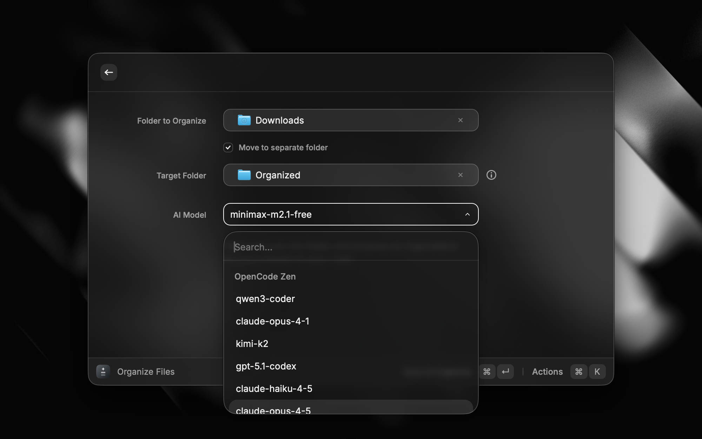

<div align="center">
  
</div>

<h1 align="center">tidyf</h1>

<div align="center">

[](https://www.npmjs.com/package/tidyf)
[](https://www.npmjs.com/package/tidyf)
[](https://github.com/yafyx/tidyf/blob/main/LICENSE)
[](https://www.npmjs.com/package/tidyf)

</div>

<p align="center">
  AI-powered file organizer CLI using <a href="https://opencode.ai">opencode.ai</a>
</p>

```text
┌   tidyf 
│
●  Source: ~/Downloads
│
●  Target: ~/Downloads/Organized
│
◇  Found 15 files
│
●  Total size: 79 MB
│
◇  Analysis complete
│
●  Proposed organization for 15 files:
│
│  Strategy: Primary categorization by file type and MIME type, secondary categorization 
│  by filename context and naming patterns. Documents go to Work, books 
│  to Education, and camera images to Photos.
│
●  📄 Documents (9 files)
│
│  [1] 📄 financial-report.pdf (596 KB)
│      → ~/Downloads/Organized/Documents/Work/financial-report.pdf
│      📄 Documents/Work 90%
│      Document with financial context and report keywords
│
│  [2] 📄 research-paper.pdf (448.6 KB)
│      → ~/Downloads/Organized/Documents/Education/research-paper.pdf
│      📄 Documents/Education 85%
│      Technical document, appears to be educational content
│
●  🖼️ Images (4 files)
│
│  [12] 🖼️ vacation-photo.jpg (361.1 KB)
│      → ~/Downloads/Organized/Images/Photos/vacation-photo.jpg
│      🖼️ Images/Photos 95%
│      Image with metadata indicating it was taken with a camera
│
■  What would you like to do?
│  ● Apply all 15 moves
│  ○ Select individually
│  ○ Regenerate analysis
│  ○ Regenerate analysis (different model)
│  ○ Cancel
│
└  Organization complete!
```

## Features

- **AI-powered organization** - Uses AI to intelligently categorize files based on name, type, and content
- **Smart folder detection** - Respects existing folder structure for consistent organization across models
- **Smart categories** - Documents, Images, Videos, Audio, Archives, Code, Applications, and more
- **Watch mode** - Monitor folders and auto-organize new files
- **Interactive CLI** - Beautiful terminal UI with confirmation prompts
- **Customizable rules** - Edit `~/.tidy/rules.md` to customize organization rules
- **Conflict handling** - Smart handling of duplicate files
- **Multiple aliases** - Use `tidyf` or `td`
- **Raycast extension** - Native macOS GUI for quick file organization

## Raycast Extension

A native Raycast extension for organizing files with a beautiful GUI. *(Coming soon to the Raycast Store)*

<div align="center">
  
  <br /><br />
  
  <br /><br />
  
</div>

## Installation

### Prerequisites

- Node.js >= 18.0.0
- [OpenCode](https://opencode.ai) installed and authenticated

#### Install OpenCode

```bash
# npm
npm install -g opencode

# or brew
brew install sst/tap/opencode
```

Then authenticate:

```bash
opencode auth
```

### Install tidyf

```bash
# bun (recommended)
bun install -g tidyf

# npm
npm install -g tidyf

# pnpm
pnpm install -g tidyf

# yarn
yarn global add tidyf
```

## Usage

### Organize Files

```bash
# Organize Downloads folder (default)
tidyf

# Organize specific folder
tidyf ~/Desktop

# Dry run (preview only)
tidyf -d

# Skip confirmation prompts
tidyf -y

# Recursive scan
tidyf -r

# Specify target directory
tidyf --target ~/Sorted
```

### Watch Mode

```bash
# Watch configured folders
tidyf watch

# Watch specific folder
tidyf watch ~/Downloads

# Auto-apply without confirmation
tidyf watch --auto

# Queue files for batch review
tidyf watch --queue

# Custom delay before processing (ms)
tidyf watch --delay 5000
```

### Configure

```bash
# Interactive configuration
tidyf config
```

## Configuration

On first run, tidyf creates `~/.tidy/` directory with configuration files:

### `~/.tidy/settings.json` - Settings

```json
{
  "organizer": { "provider": "opencode", "model": "claude-sonnet-4-5" },
  "defaultSource": "~/Downloads",
  "defaultTarget": "~/Documents/Organized",
  "watchEnabled": false,
  "folders": [
    { "sources": ["~/Downloads"], "target": "~/Documents/Organized", "watch": false }
  ],
  "ignore": [".DS_Store", "*.tmp", "*.partial", "*.crdownload"]
}
```

### `~/.tidy/rules.md` - Organization Rules

Controls how AI categorizes files. Default includes:

- **Documents** - PDFs, Word docs, text files, spreadsheets
- **Images** - Photos, screenshots, graphics, icons
- **Videos** - MP4, MOV, AVI, MKV, WEBM
- **Audio** - MP3, WAV, FLAC, AAC
- **Archives** - ZIP, RAR, 7Z, TAR
- **Code** - Source files, project archives
- **Applications** - DMG, PKG, EXE, installers

Edit this file to customize AI behavior for your workflow.

## Commands

| Command | Description |
|---------|-------------|
| `tidyf [path]` | Organize files in path (default: ~/Downloads) |
| `tidyf watch [paths...]` | Watch folders for new files |
| `tidyf config` | Configure models and settings |

## Options

### Organize Options

| Option | Description |
|--------|-------------|
| `-d, --dry-run` | Preview changes without moving files |
| `-y, --yes` | Skip confirmation prompts |
| `-r, --recursive` | Scan subdirectories |
| `-s, --source <path>` | Source directory to organize |
| `-t, --target <path>` | Specify target directory |
| `-m, --model <id>` | Override AI model |
| `-V, --version` | Show version number |
| `-h, --help` | Show help |

### Watch Options

| Option | Description |
|--------|-------------|
| `--auto` | Auto-apply without confirmation |
| `--queue` | Queue files for batch review |
| `--delay <ms>` | Debounce delay (default: 3000) |

## How It Works

1. **Scans directory** - Reads file metadata (name, type, size, modified date)
2. **Analyzes with AI** - Sends file info to AI with your configured rules
3. **Proposes organization** - Shows categorization with confidence levels
4. **Confirms with you** - Presents interactive UI for approval
   - Apply all moves
   - View file details
   - Regenerate analysis (optional: with different instructions)
   - Regenerate analysis (different model) — choose another provider/model
   - Cancel
5. **Moves files** - Organizes files into target directory structure

## Smart Folder Detection

tidyf automatically detects existing folders in your target directory and instructs the AI to prefer them. This ensures:

- **Consistency across models** - Different AI models will use the same folder names
- **No duplicate folders** - Won't create "Screenshots" if "Screen Captures" already exists
- **Respects your structure** - Extends your existing organization rather than overwriting it

The tool scans up to 3 levels deep and includes up to 100 existing folders in the AI context.

## Examples

### Basic Organization

```bash
$ tidyf
┌   tidyf 
│
●  Source: ~/Downloads
│
●  Target: ~/Downloads/Organized
│
◇  Found 12 files
│
●  Total size: 45 MB
│
◇  Analysis complete
│
●  Proposed organization for 12 files:
│
│  Strategy: Primary categorization by file type and MIME type, secondary categorization 
│  by filename context and naming patterns...
│
●  📄 Documents (5 files)
│
│  [1] 📄 project-proposal.pdf (245 KB)
│      → ~/Downloads/Organized/Documents/Work/project-proposal.pdf
│      📄 Documents/Work 95%
│      Business document with project keywords
│
■  What would you like to do?
│  ● Apply all 12 moves
│  ○ Select individually
│  ○ Cancel
│
└  Organization complete!
```

### Interactive Configuration

```bash
$ tidyf config
┌   tidyf config 
│
●  Configuring global settings
│
│  Config: ~/.tidy/settings.json
│
◇  What would you like to configure?
│  AI Model
│
◇  Fetched 2 providers
│
●  Current Model: opencode/big-pickle
│
◇  Select AI provider:
│  OpenCode Zen
│
◇  Select model:
│  glm-4.7-free
│
◆  Model set to opencode/glm-4.7-free
│
◇  What would you like to configure?
│  Done
│
└  Configuration saved!
```

### Watch Mode

```bash
$ tidyf watch ~/Downloads --auto
┌   tidyf watch
│
◇  Watching directories:
│    ~/Downloads
│
◇  Target: ~/Documents/Organized
│
⚠  Auto mode: Files will be moved without confirmation
│
◇  Watcher ready
│    Press Ctrl+C to stop watching
│
│  + 2 new file(s) detected
│    📄 document.pdf → Documents
│    🖼️  screenshot.png → Images/Screenshots
│
◇  Moved 2 files
```

## Troubleshooting

### "OpenCode CLI is not installed"

Install OpenCode first:

```bash
npm install -g opencode
# or
brew install sst/tap/opencode
```

### "Not authenticated with OpenCode"

Run authentication:

```bash
opencode auth
```

### "Permission denied"

Make sure you have write access to both source and target directories.

### Files not being detected

Check if the file matches an ignore pattern in `~/.tidy/settings.json`.

## Development

```bash
# Clone the repo
git clone https://github.com/yafyx/tidyf.git
cd tidyf

# Install dependencies
bun install

# Run in development mode
bun run dev

# Build for production
bun run build

# Type check
bun run typecheck
```

## License

MIT

## Links

- [OpenCode](https://opencode.ai) - AI coding assistant
- [OpenCode Docs](https://opencode.ai/docs) - Documentation
